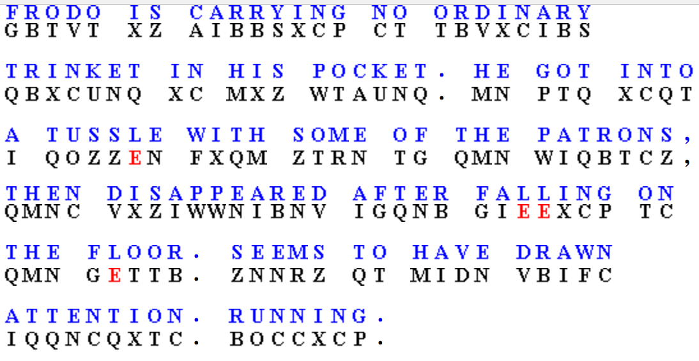

## Author
bashNinja - [@miketweaver](https://twitter.com/miketweaver)

## Solution

So I'm a little ashamed of the way I solved this, and I'll share the 'correct' way at the end of my solution, but it's good to know about all the tools available during a CTF.

We were given:

```
GBTVT XZ AIBBSXCP CT TBVXCIBS QBXCUNQ XC MXZ WTAUNQ. MN PTQ XCQT I QOZZEN FXQM ZTRN TG QMN WIQBTCZ, QMNC VXZIWWNIBNV IGQNB GIEEXCP TC QMN GETTB. ZNNRZ QT MIDN VBIFC IQQNCQXTC. BOCCXCP.
```

I spend almost 20 minutes piling through various ciphers/keys and never got anywhere. By looking at it, it looks like a simple substution cipher as it keeps its formatting with commas and periods. 

At this point I decided to throw it through an automated tool:
http://quipqiup.com/

That's better:
`FRODO IS CARRYING NO ORDINARY TRIN?ET IN HIS POC?ET. HE GOT INTO A TUSSLE WITH SOME OF THE PATRONS, THEN DISAPPEARED AFTER FALLING ON THE FLOOR. SEEMS TO HAVE DRAWN ATTENTION. RUNNING`

It looks like it missed the letter `K`, which we can guess from the words. Add that in, and we've got it!

## Better Solution

After talking with [Aaron](https://twitter.com/AaronToponce) after the competition, he shared that the best way to solve this is frequency analysis. Hence why quipqiup worked so well. Frequency analysis is basically counting the number of occurrences of a letter (or sets of letters). 

The tool I used for single character analysis was:
http://www.simonsingh.net/The_Black_Chamber/letterfrequencies.html


This looks pretty evenly spread. There are a few spikes, probably the common vowels/consonants, but nothing else.

Now let's check out the bigrams and trigrams:
http://www.richkni.co.uk/php/crypta/freq.php


#### Single Letter frequencies
```
q : 16
c : 16
t : 15
n : 15
b : 12
x : 12
i : 11
z : 9
m : 7
g : 5
v : 5
w : 4
e : 4
p : 4
u : 2
s : 2
f : 2
r : 2
o : 2
a : 2
d : 1
y : 0
k : 0
l : 0
j : 0
h : 0
```
#### Double letter sequences
```
xc => 7
qm => 4
mn => 4
```

Ok, this looks pretty standard too. It must be just a normal [cryptogram](https://en.wikipedia.org/wiki/Cryptogram). There's tons of information online about [how to solve](http://www.cryptograms.org/tutorial.php) cryptograms, so go check them out.

My favorite tool for solving this is:
http://scottbryce.com/cryptograms/

And here's the solution:


## Key
FRODO IS CARRYING NO ORDINARY TRINKET IN HIS POCKET. HE GOT INTO A TUSSLE WITH SOME OF THE PATRONS, THEN DISAPPEARED AFTER FALLING ON THE FLOOR. SEEMS TO HAVE DRAWN ATTENTION. RUNNING
