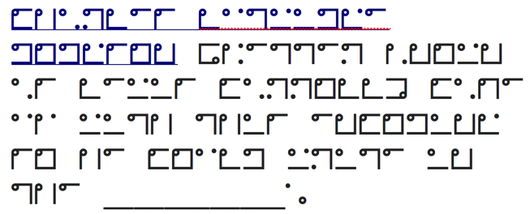

## Author
bashNinja - [@miketweaver](https://twitter.com/miketweaver)

## Solution

So we're given this image:



Which looks similar to the "Dancing Men" except something else.

I've never seen it before, so I took the title and searched "Through the Looking Glass".
That turned out to be a book written by Lewis Carroll, and there's some mention of an `Alphabet Cipher` but this isn't that. I figured that if he wrote one cipher, he might have written more, so I looked into the Author:

https://en.wikipedia.org/wiki/Lewis_Carroll#Inventions

In this inventions section on wikipedia, it says he's made a lot of ciphers, including this thing called a Nyctograph.

http://www.lewiscarroll.org/tag/nyctograph/

Perfect! That's exactly what we want. It decodes to:
```
Charles Lutwidge Dodgson (better known as Lewis Carroll)
came up with this encoding so he could write in the ____.
```
Answer the question, and that's the key.

## Key
dark
