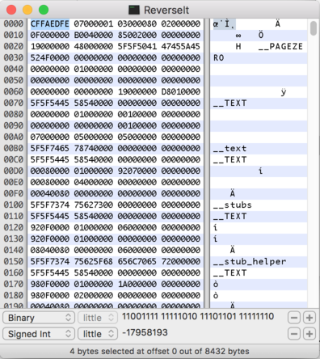

## Author
bashNinja - [@miketweaver](https://twitter.com/miketweaver)

## Solution

So we're given this file `ReverseIt`. Let's do some digging on the file and see what it is.

```
$ file ReverseIt
ReverseIt: data

$ strings ReverseIt
__PAGEZERO
__TEXT
__text
__TEXT
__stubs
__TEXT
__stub_helper
__TEXT
__cstring
__TEXT
__unwind_info
__TEXT
__DATA
__nl_symbol_ptr
__DATA
__la_symbol_ptr
__DATA
__LINKEDIT
/usr/lib/dyld
/usr/lib/libSystem.B.dylib
@dyld_stub_binder
@_printf
_mh_execute_header
!main
__mh_execute_header
_main
_printf
dyld_stub_binder
```

Ok. This is weird. `File` doesn't pick anything up, but there obviously stuff in here. A google search for [PAGEZERO](http://lmgtfy.com/?q=__PAGEZERO) brings up info on Mach-O, which was the binary filetype from the last challenge. Why doesn't `file` pick that up? Here's some useful info on the file command:
>file looks only at the file content, not at the file name. (It also looks at some file metadata such as the file type: directory, symbolic link, named pipe, etc. But in the cases you're interested in, it's the content that matters.)
>
>file typically guesses the format of a file by looking at the first few bytes and comparing them with a built-in table of magic numbers. For example, if the file begins with %PDF, then file reports “PDF document” (and goes digging further to report the minimum version). For file types that don't start with [magic numbers](http://en.wikipedia.org/wiki/Magic_number_(programming)), it contains heuristics, e.g. report “ASCII text” if the first few bytes are all in the printable ASCII range.

[source](http://unix.stackexchange.com/a/151036)

Ok, so file can't pick it up because the 'magic numbers' don't appear? Let's compare the first few bits on the header of the Mach-O file from the last challenge and the file we have from the current one.

```
$ xxd MyFirstApp | head
00000000: cffa edfe 0700 0001 0300 0080 0200 0000  ................
00000010: 0f00 0000 b004 0000 8500 2000 0000 0000  .......... .....
00000020: 1900 0000 4800 0000 5f5f 5041 4745 5a45  ....H...__PAGEZE
00000030: 524f 0000 0000 0000 0000 0000 0000 0000  RO..............
00000040: 0000 0000 0100 0000 0000 0000 0000 0000  ................
00000050: 0000 0000 0000 0000 0000 0000 0000 0000  ................
00000060: 0000 0000 0000 0000 1900 0000 d801 0000  ................
00000070: 5f5f 5445 5854 0000 0000 0000 0000 0000  __TEXT..........
00000080: 0000 0000 0100 0000 0010 0000 0000 0000  ................
00000090: 0000 0000 0000 0000 0010 0000 0000 0000  ................

$ xxd ReverseIt | head
00000000: 0700 0001 0300 0080 0200 0000 0f00 0000  ................
00000010: b004 0000 8500 2000 0000 0000 1900 0000  ...... .........
00000020: 4800 0000 5f5f 5041 4745 5a45 524f 0000  H...__PAGEZERO..
00000030: 0000 0000 0000 0000 0000 0000 0000 0000  ................
00000040: 0100 0000 0000 0000 0000 0000 0000 0000  ................
00000050: 0000 0000 0000 0000 0000 0000 0000 0000  ................
00000060: 0000 0000 1900 0000 d801 0000 5f5f 5445  ............__TE
00000070: 5854 0000 0000 0000 0000 0000 0000 0000  XT..............
00000080: 0100 0000 0010 0000 0000 0000 0000 0000  ................
00000090: 0000 0000 0010 0000 0000 0000 0700 0000  ................
```

Ah ha! Look at that! `ReverseIt` is missing `cffa edf` at the beginning of the file. Let's add that to the beginning of it.

I used [Hex Fiend](http://ridiculousfish.com/hexfiend/) on my Mac to edit the file. If you use it, make sure to go into insert mode(⇧ ⌘ I):


Save the file, and run it on a Mac!

```
$ chmod +x ReverseIt

$ ./ReverseIt
ǝpoɔ ƃuısɹǝʌǝɹ ǝq ʇsnɾ pןnoʍ ʇı ʇɥƃnoɥʇ noʎ puɐ :ƃɐןɟ
```

## Key
and you thought it would just be reversing code
